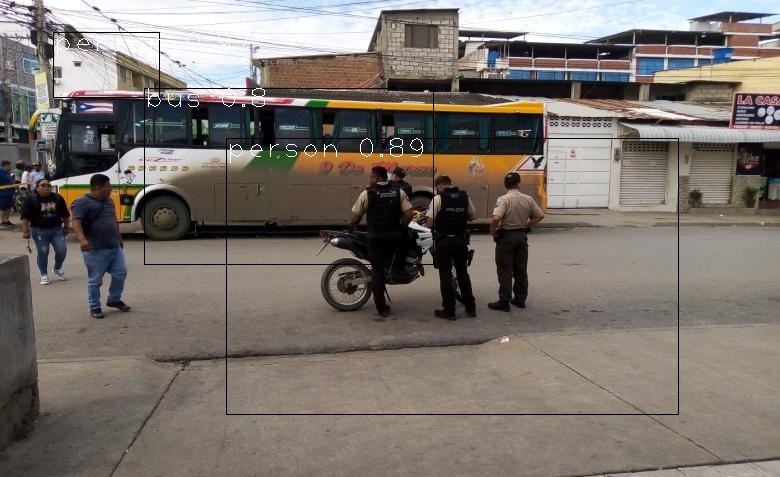
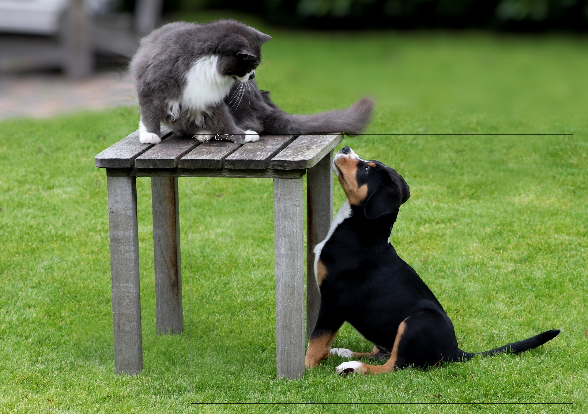

# 🔍 Image-Based Object Detection with YOLOv3-tiny and OpenCV

This project demonstrates object detection in static images using **YOLOv3-tiny** and **OpenCV** in Python. The model detects and labels multiple objects with bounding boxes, using pretrained weights trained on the COCO dataset.

## 📷 Example Output

---

## ✅ Features

- Object detection using **YOLOv3-tiny**
- Pre-trained on the **COCO dataset**
- Filter detections by **confidence threshold**
- **Non-Maximum Suppression (NMS)** to remove duplicate boxes
- Display object **labels and confidence scores**
- Output saved with bounding boxes and annotations

---

## 🧰 Technologies Used

- Python
- OpenCV
- Matplotlib
- YOLOv3-tiny
- COCO Dataset

---

## 📁 Folder Structure

YOLO_Object_Detection/
│
├── yolov3-tiny.cfg
├── yolov3-tiny.weights
├── coco.names
├── Image/
│ ├── Image1.jpeg # Input image
│ └── img.jpg # Output image with detection
├── object_detection.ipynb # Main code file
└── README.md # This file
